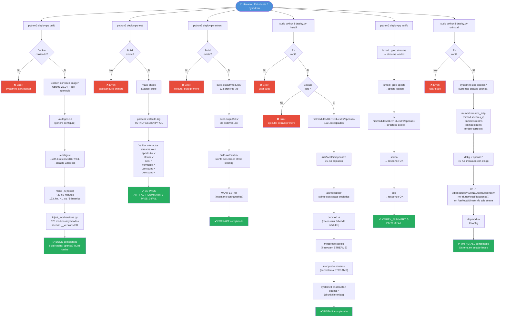
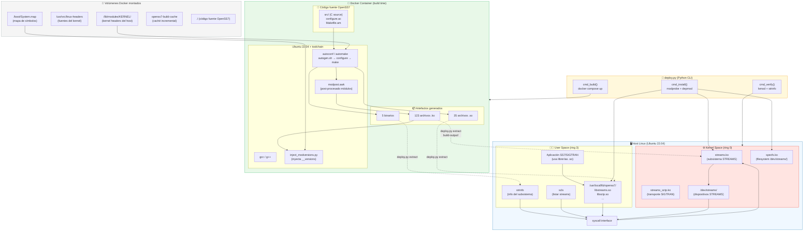
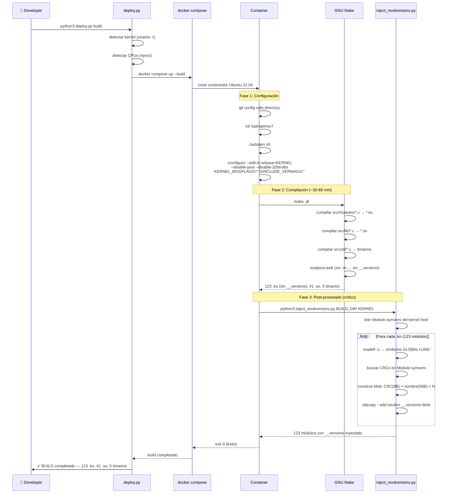
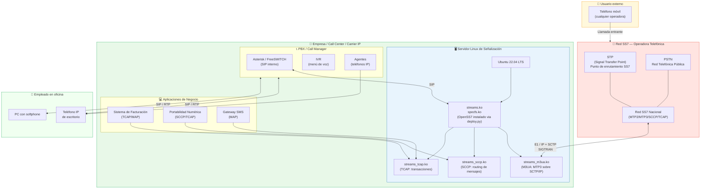
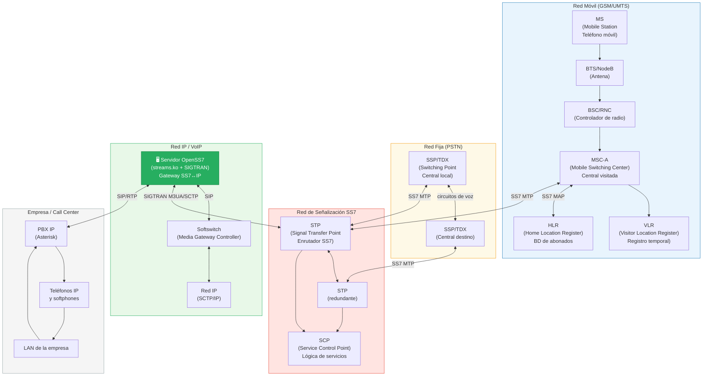

# Diagramas de Flujo y Arquitectura — OpenSS7 Deploy System

> Todos los diagramas están en formato **Mermaid**.
> Para renderizarlos como imagen PNG, puedes copiar el bloque y pegarlo en:
> - **https://mermaid.live** (recomendado, gratuito, sin registro)
> - **https://kroki.io** (alternativa open-source)
> - Extensiones de VSCode: "Mermaid Preview", "Markdown Preview Mermaid Support"
> - GitHub y GitLab renderizan Mermaid automáticamente en archivos .md

---

## Diagrama 1 — Flujo completo del CLI (deploy.py)

> Muestra el recorrido de cada comando desde que el usuario lo ejecuta hasta el resultado final.



---

## Diagrama 2 — Arquitectura del sistema

> Muestra cómo interactúan Docker, el host Linux y el kernel en tiempo real.



---

## Diagrama 3 — Proceso interno del build (detalle técnico)

> Para estudiantes avanzados: qué ocurre dentro del contenedor Docker durante la compilación.



---

## Diagrama 4 — Caso real: Empresa de telecomunicaciones

> Flujo de implementación en una empresa real que necesita conectarse a la red SS7 de una operadora. Experiencia desde la perspectiva del ingeniero y del usuario final.



---

## Diagrama 5 — Experiencia de usuario: llamada a través de OpenSS7

> Traza el recorrido completo de una llamada desde que un cliente llama a una empresa hasta que el agente responde, mostrando qué hace OpenSS7 en cada paso.

```mermaid
sequenceDiagram
    participant CLIENT as 📱 Cliente<br/>(teléfono móvil)
    participant OPER as 📡 Operadora<br/>(red SS7)
    participant GW as 🖥️ Servidor<br/>OpenSS7 (Linux)
    participant PBX as 📞 PBX<br/>(Asterisk)
    participant AGENT as 👤 Agente<br/>(teléfono IP)

    Note over CLIENT,AGENT: Flujo de una llamada entrante al call center

    CLIENT->>OPER: Marca +57 1 234 5678 (número del call center)
    OPER->>OPER: SS7 MTP3: enrutar hacia destino
    OPER->>OPER: SCCP: identificar Point Code destino
    OPER->>OPER: ISUP: IAM (Initial Address Message) → configurar circuito

    OPER->>GW: SIGTRAN M3UA sobre SCTP/IP<br/>IAM con número llamado y llamante

    Note over GW: OpenSS7 procesa el mensaje
    GW->>GW: streams_m3ua.ko: desencapsular M3UA
    GW->>GW: streams_sccp.ko: resolver routing SCCP
    GW->>GW: streams_isup.ko: procesar ISUP IAM
    GW->>GW: Consultar portabilidad numérica (TCAP HLR)

    GW->>OPER: TCAP SRI (Send Routing Info)
    OPER-->>GW: TCAP SRI-ACK + info de enrutamiento

    GW->>PBX: SIP INVITE (llamada entrante)
    PBX->>PBX: Evaluar dialplan
    PBX->>PBX: IVR: "Bienvenido, marque 1 para ventas..."
    PBX->>CLIENT: SIP 183 Progress → Audio IVR
    CLIENT->>PBX: DTMF "1" (usuario marca ventas)

    PBX->>PBX: Cola de agentes disponibles
    PBX->>AGENT: SIP INVITE (llamada a agente)
    AGENT-->>PBX: SIP 200 OK (agente responde)
    PBX-->>GW: SIP 200 OK (llamada conectada)

    GW->>OPER: ISUP ANM (Answer Message)
    OPER-->>CLIENT: Llamada conectada ✅

    Note over CLIENT,AGENT: Conversación en curso (RTP audio)
    CLIENT<-->AGENT: 🎤 Conversación de voz (RTP)

    Note over CLIENT,AGENT: Fin de llamada
    AGENT->>PBX: Cuelga (SIP BYE)
    PBX->>GW: SIP BYE
    GW->>OPER: ISUP REL (Release)
    OPER-->>GW: ISUP RLC (Release Complete)
    OPER->>CLIENT: Llamada terminada

    Note over GW: OpenSS7 registra CDR (Call Detail Record)
    GW->>GW: Generar registro de facturación
```

---

## Diagrama 6 — Ciclo de vida del deploy (vista de proyecto)

> Para coordinadores de proyecto o estudiantes de gestión de TI: cómo se ve el despliegue como proceso de proyecto.

```mermaid
gantt
    title Despliegue OpenSS7 — Línea de tiempo típica
    dateFormat HH:mm
    axisFormat %H:%M

    section Preparación (una vez)
    Instalar Docker y dependencias     :prep1, 00:00, 15m
    Clonar repositorio                 :prep2, after prep1, 5m
    Verificar kernel headers           :prep3, after prep2, 5m

    section Build (primera vez)
    docker compose build (imagen)      :build1, after prep3, 10m
    ./configure dentro del contenedor  :build2, after build1, 5m
    make -j$(nproc) compilar todo      :crit, build3, after build2, 40m
    inject_modversions.py              :build4, after build3, 2m

    section Build (con caché)
    Rebuild incremental                :cache1, after build4, 2m

    section Validación
    make check (tests)                 :test1, after build4, 10m
    Validar 7 artefactos               :test2, after test1, 2m

    section Deploy en host
    Extract artefactos                 :ext1, after test2, 1m
    Install (modprobe)                 :inst1, after ext1, 1m
    Verify (5 checks)                  :ver1, after inst1, 1m

    section Producción
    Deploy en VPS                      :vps1, after ver1, 60m
    Verify en VPS                      :vps2, after vps1, 5m
```



---

## Diagrama 7 — Arquitectura de red SS7 completa

> Mapa de los nodos de una red SS7 típica y dónde encaja OpenSS7.



---

## Cómo usar estos diagramas

### En mermaid.live (más fácil)

1. Abrir **https://mermaid.live**
2. Borrar el ejemplo que aparece en el editor izquierdo
3. Copiar el contenido del bloque ` ```mermaid ` (sin las comillas de markdown)
4. El diagrama aparece instantáneamente a la derecha
5. Botón **"PNG"** para descargar como imagen

### En GitHub / GitLab

Los archivos `.md` con bloques ` ```mermaid ` se renderizan automáticamente en la vista web del repositorio. No necesitas hacer nada.

### En VSCode

Instalar la extensión **"Markdown Preview Mermaid Support"** y usar `Ctrl+Shift+V` para preview.

### Exportar a PNG en alta resolución

Para presentaciones:
1. Ir a **https://mermaid.live**
2. Pegar el diagrama
3. Click en **Actions** → **PNG** → ajustar escala a 2x o 3x
4. Descargar

---

*Volver al índice: [README.md](README.md)*
