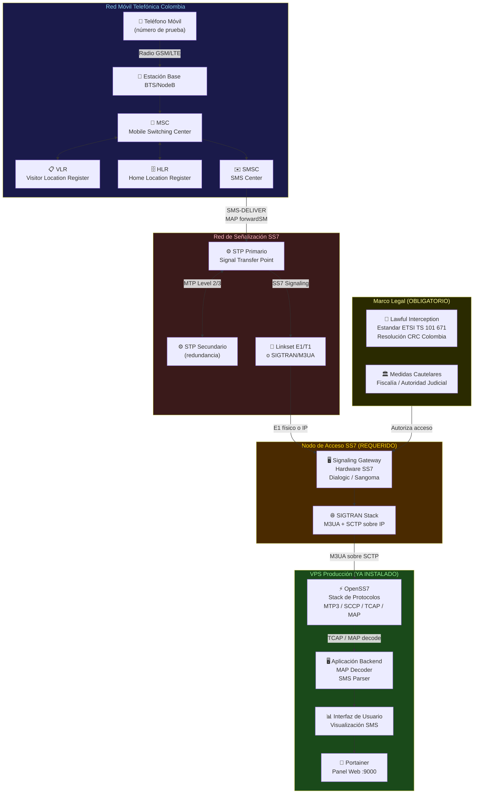
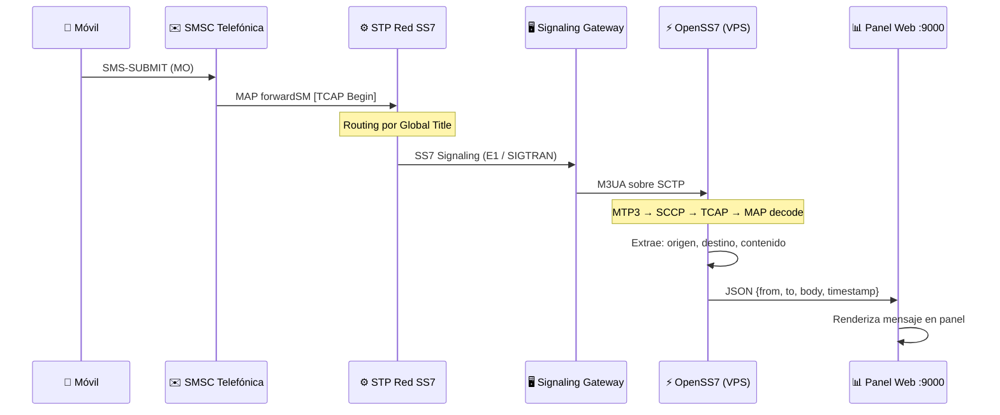
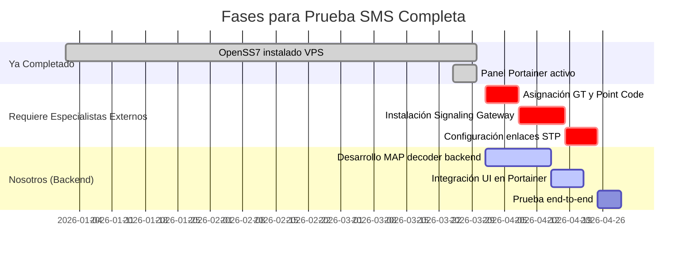

# Requerimiento Técnico Real: Prueba de Interceptación SMS via SS7
## Documento Técnico para Colombia Telecomunicaciones S.A. E.S.P (Telefónica)

**Fecha**: 30 de marzo de 2026  
**Preparado por**: Equipo de Infraestructura SS7  
**Dirigido a**: Dirección Global IT Procurement — Alfonso Enriquez Huidobro  

---

## 1. Contexto y Propósito del Documento

Este documento responde a la solicitud de probar el correcto funcionamiento del **Software SS7 (OpenSS7)** instalado en la VPS de producción (`129.121.60.55`), específicamente para demostrar la capacidad de recibir y visualizar mensajes SMS a través de la red de señalización SS7.

El objetivo es explicar con precisión técnica:

- Qué infraestructura adicional se requiere para realizar esa prueba
- Cuál es el rol exacto de OpenSS7 dentro de esa arquitectura
- Quiénes son los especialistas necesarios para completar cada capa
- Qué ya está listo y funcionando en la VPS actual

---

## 2. Diagnóstico: Por Qué la VPS Sola No Es Suficiente

OpenSS7 es un **stack de protocolos SS7 para Linux**. Equivale a tener el motor y la caja de cambios de un automóvil perfectamente instalados — pero sin carretera ni combustible.

La VPS actual tiene:

| Componente | Estado | Verificado |
|-----------|--------|-----------|
| Módulos kernel SS7 (`streams.ko`, `specfs.ko`) | ACTIVOS | Sí (5/5 PASS) |
| Stack de protocolos MTP / SCCP / TCAP / MAP | INSTALADO | Sí |
| Panel web de monitoreo (Portainer) | ACTIVO en :9000 | Sí |
| Conectividad a red SS7 real | **NO EXISTE** | No aplica |
| Global Title (GT) asignado | **NO EXISTE** | No aplica |
| Enlace físico o SIGTRAN a operadora | **NO EXISTE** | No aplica |

**Conclusión**: OpenSS7 está correctamente instalado y funcionando. El gap no es el software — es la infraestructura de red de señalización que lo rodea.

---

## 3. Arquitectura Completa Requerida

### 3.1 Diagrama de Flujo — Infraestructura SS7 para Prueba SMS



---

### 3.2 Flujo de Datos: Del SMS al Panel Web



---

## 4. Componentes Faltantes y Especialistas Requeridos

### 4.1 Hardware de Conectividad SS7

| Dispositivo | Función | Fabricante | Responsable |
|-----------|---------|-----------|-------------|
| **Tarjeta SS7 E1/T1** | Conecta físicamente al STP de Telefónica | Dialogic SS7G2x / Sangoma A10x | Ingeniero de HW Telecom |
| **Signaling Gateway** | Convierte SS7 físico a SIGTRAN/IP | Ulticom / Openwave | Arquitecto Core Network |
| **STP de prueba** | Punto de transferencia de señalización | HP c-Class / Cisco | Equipo Core SS7 Telefónica |

### 4.2 Configuración de Red SS7

| Parámetro | Descripción | Quién lo asigna |
|-----------|-------------|----------------|
| **Global Title (GT)** | Dirección de señalización única en la red | Coordinador de Numeración Telefónica |
| **Point Code** | Identificador del nodo en la red SS7 | Equipo de Ingeniería Core |
| **Linkset** | Conjunto de enlaces SS7 al STP | Equipo de Transmisión |
| **SCCP Routing Rules** | Enrutamiento de mensajes MAP | Arquitecto SS7 |

### 4.3 Marco Regulatorio

| Requisito | Norma | Emisor |
|-----------|-------|--------|
| Autorización de interceptación | Resolución CRC 5050/2016 | Comisión de Regulación de Comunicaciones Colombia |
| Estándar técnico LI | ETSI TS 101 671 | ETSI |
| Custodia de información | Ley 1273/2009 | Congreso de Colombia |

---

## 5. Rol de OpenSS7 en esta Arquitectura

OpenSS7 es el **corazón del procesamiento de señalización**. Una vez que la infraestructura de red esté conectada, OpenSS7 en la VPS se encarga de:

```
Capa 1 (MTP Level 1)  →  Manejada por hardware SS7 (Dialogic/Sangoma)
Capa 2 (MTP Level 2)  →  OpenSS7: streams_sl.ko (Signaling Link)
Capa 3 (MTP Level 3)  →  OpenSS7: streams_mtp.ko (Message Transfer Part)
Capa 4 (SCCP)         →  OpenSS7: streams_sccp.ko (Conexionless/Connection)
Capa 5 (TCAP)         →  OpenSS7: streams_tcap.ko (Transaction Capabilities)
Capa 6 (MAP)          →  OpenSS7: MAP stack (Mobile Application Part)
Capa 7 (Aplicación)   →  Backend a desarrollar (SMS parser → UI)
```

**Lo que ya funciona en la VPS**: Capas 2 a 6 instaladas y verificadas.  
**Lo que falta**: Capa 1 (hardware físico) y la conectividad a la red SS7 real de Telefónica.

---

## 6. Estimación de Implementación



---

## 7. Resumen Ejecutivo

| Pregunta | Respuesta |
|---------|----------|
| ¿OpenSS7 está correctamente instalado? | **SÍ** — 5/5 verificaciones PASS |
| ¿El software puede procesar SMS cuando se conecte? | **SÍ** — stack MAP/TCAP/SCCP activo |
| ¿Puede hacer la prueba solo con la VPS actual? | **NO** — falta conectividad a red SS7 real |
| ¿Qué falta? | Hardware SS7, Global Title, enlace al STP de Telefónica, autorización LI |
| ¿Quiénes deben intervenir? | Ingenieros Core Network, Equipo de Transmisión, Coordinador de Numeración |
| ¿Cuál es el rol en este proyecto? | Capa de software SS7 (capas 2-6) + UI de monitoreo |

**El software está listo para su función. La prueba completa requiere que el equipo de ingeniería de red de Telefónica Colombia conecte la infraestructura de señalización SS7 al nodo donde OpenSS7 está instalado.**

---

*Documento preparado como parte del proceso de evaluación técnica — Colombia Telecomunicaciones S.A. E.S.P*
